<p align="center">
  
</p>

<h1 align="center">FROGDROP</h1>
<p align="center"><strong>Drop your listings everywhere.</strong></p>
<p align="center">
  The all-in-one desktop app for resellers. Manage your eBay, Vinted, and Wallapop listings from a single interface, with AI that writes your listings for you.
</p>

<p align="center">
  <a href="https://github.com/nowfrog/frogdrop/releases/latest">
    
  </a>
  
  
  <a href="https://paypal.me/andreamorana">
    
  </a>
</p>

<p align="center">
  <a href="#download"><strong>Download</strong></a> · <a href="#features"><strong>Features</strong></a> · <a href="#getting-started"><strong>Getting Started</strong></a> · <a href="#support-the-project"><strong>Donate</strong></a>
</p>

---

## Overview

FROGDROP is a free, open-source desktop application built for resellers who list products on multiple platforms. Instead of switching between browser tabs, copying and pasting titles and descriptions, and uploading the same photos over and over, you do everything from one place.

Drop your photos in, let Claude AI generate professional listings in seconds, then publish to eBay with one click or drag info into Vinted and Wallapop's built-in browsers. That's it.

<!-- SCREENSHOT: full app overview showing the store selector or a listing being edited -->
<p align="center">
  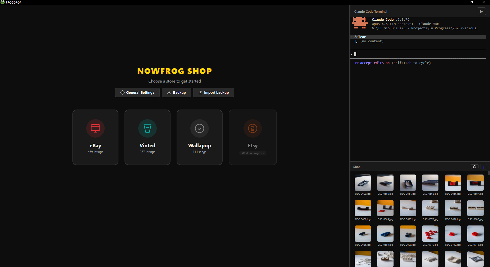
</p>

---

## Download

| Version | Description | Link |
|---------|-------------|------|
| **Portable** (recommended) | Single .exe file. No installation. Double-click and run. | [**Download**](https://github.com/nowfrog/frogdrop/releases/latest) |
| **Installer** | Traditional Windows setup with Start Menu shortcut. | [**Download**](https://github.com/nowfrog/frogdrop/releases/latest) |
| **Source** | Run from source code with Node.js. | See [Getting Started](#run-from-source) |

> **Note:** Windows may show a SmartScreen warning since the app isn't code-signed. Click "More info" then "Run anyway". This is normal for open-source apps.

---

## Features

### 🏪 Multi-Platform Selling

Sell on all the major second-hand platforms from one app:

- **eBay** has full API integration. Create listings, upload photos, set prices, categories, item specifics, and shipping options, then publish directly without opening a browser. You can also edit and sync existing listings, and track published/draft status.
- **Vinted** uses a built-in browser with your listing data on the left panel. Copy title, description, and price with one click, and drag photos directly into Vinted's upload form.
- **Wallapop** works the same way as Vinted, with a built-in browser, assisted upload, and photo drag & drop.
- **Etsy** is currently a work in progress.

<!-- SCREENSHOT: store selector page showing all platforms -->
<p align="center">
  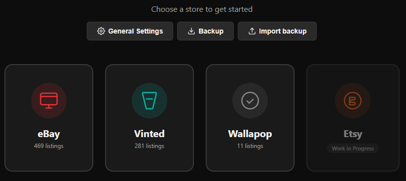
</p>

### 🤖 AI-Powered Listing Generation

Stop writing titles and descriptions manually. Drop your photos and let **Claude Code** (Anthropic's AI) do the work:

1. **Drop photos** of your item into the app
2. **Click "Generate"** and Claude analyzes the photos and creates a complete listing
3. **Review and publish** the result: title, description, price suggestion, condition, category, and item specifics are all generated automatically

Works in **any language**. You can generate listings in English, Italian, French, German, or any of the 11 supported languages. Each store can have its own listing language.

<!-- SCREENSHOT: the batch listing view with photos on left, generate button, and preview on right -->
<p align="center">
  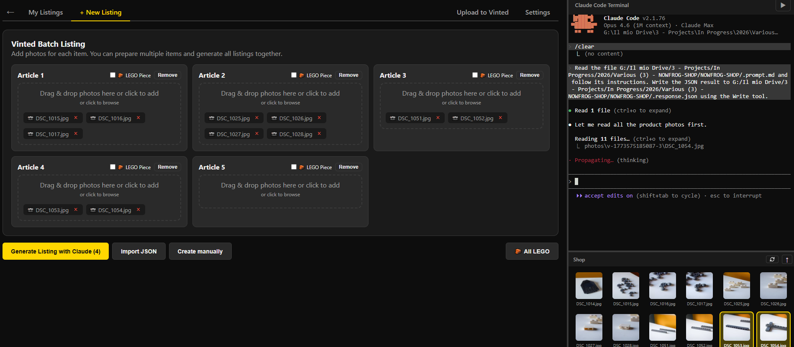
</p>

**Batch processing:** Drop multiple sets of photos at once. Each set becomes a separate listing. Generate all of them in one go.

<!-- SCREENSHOT: batch articles grid with multiple listings being generated -->
<p align="center">
  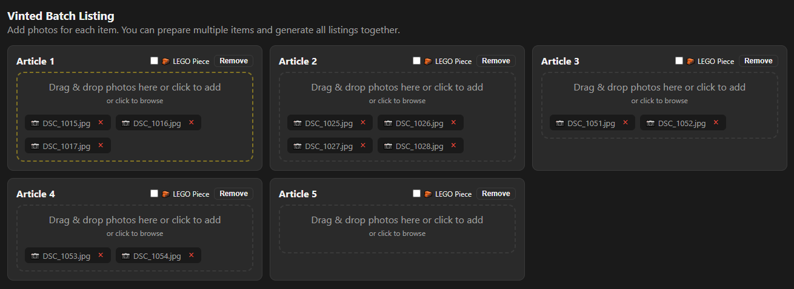
</p>

### 🧱 LEGO Part Recognizer

Built specifically for LEGO resellers:

- Drop a photo of a LEGO part and Claude identifies the **part number, color, and name**
- The app automatically fetches **3D renders** from BrickLink/Rebrickable and adds them to your listing photos
- Generate dozens of LEGO part listings at once with accurate part data using the bulk workflow
- Filter your listings by LEGO parts and refresh all renders in one click

<!-- SCREENSHOT: a LEGO listing showing the part recognition and 3D render -->
<p align="center">
  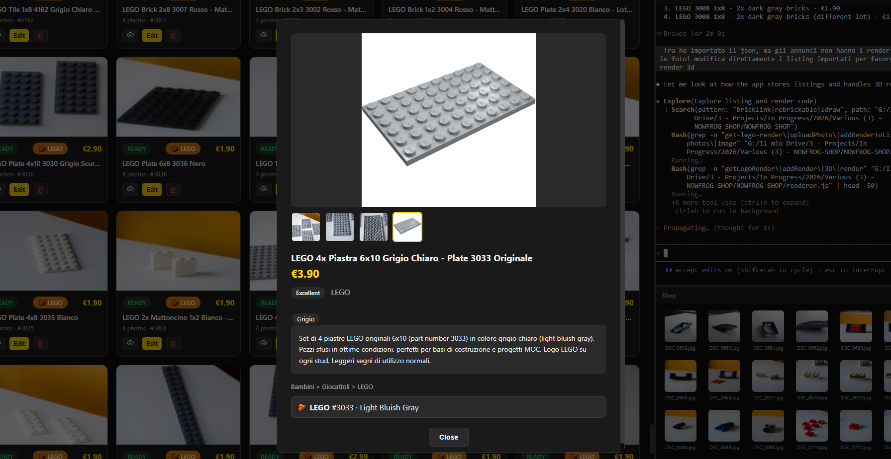
</p>

### 📝 Full Listing Editor

Every listing field you need, in one clean form:

- Title with live character count
- Description with HTML preview
- Category search and selection (eBay category tree)
- Condition and condition description
- Price and quantity
- Item specifics, auto-loaded from eBay based on the selected category
- Shipping options including service, cost, and free shipping toggle
- Photo management with drag-to-reorder

<!-- SCREENSHOT: the listing edit form with all fields visible -->
<p align="center">
  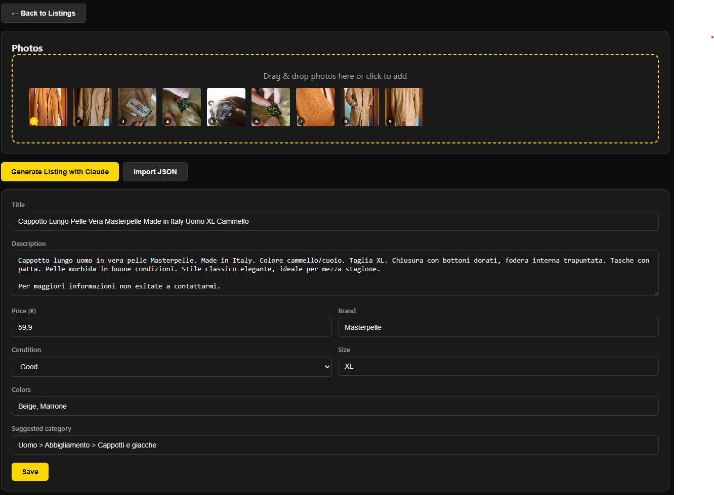
</p>

### 📸 Smart Photo Management

- **Drag & drop** photos from your file system or from the built-in file explorer
- **Reorder** photos by dragging them within the listing
- **Set main photo** with one click
- **Lazy-loaded thumbnails** keep the app fast even with hundreds of listings
- **Auto-resize** ensures photos are automatically optimized for upload

### 🔄 Vinted & Wallapop Upload

A split-view workflow designed for speed:

- **Left panel** shows your ready listings with all data: title, description, price, and photos
- **Right panel** shows the platform's website in a built-in browser
- Copy title, description, or price to clipboard with **one click**
- **Drag photos** directly from the listing card into the upload form
- **Mark as published** when done to keep track of what you've already uploaded

<!-- SCREENSHOT: Vinted upload split view with listings on left and browser on right -->
<p align="center">
  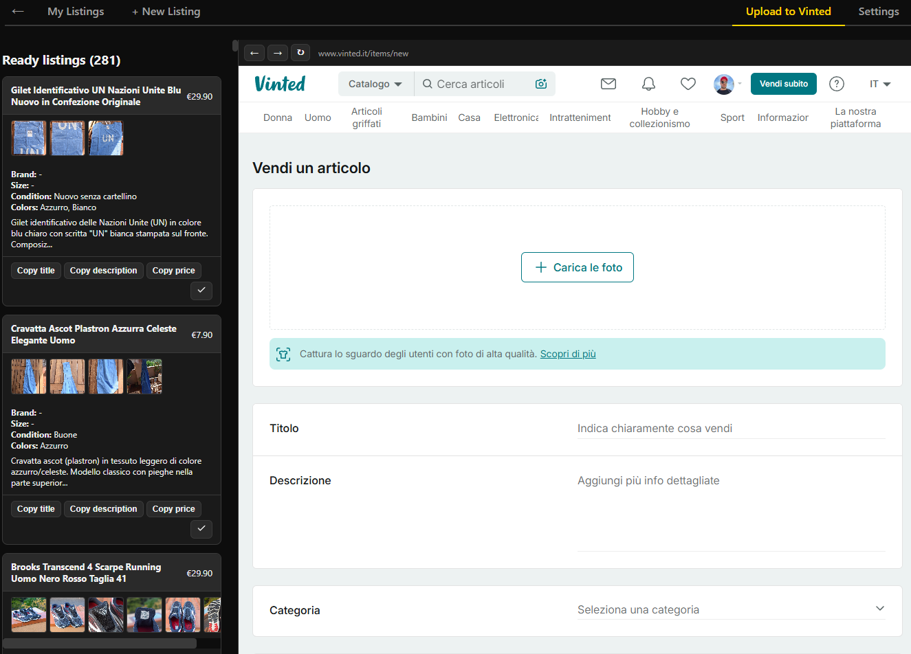
</p>

### 📂 Built-in File Explorer

Browse your photo folders without leaving the app:

- Navigate directories with a breadcrumb path
- See image thumbnails as you browse
- Select multiple photos and drag them into listings
- Resizable panel so you can adjust how much space it takes

<!-- SCREENSHOT: the file explorer panel showing photo thumbnails -->
<p align="center">
  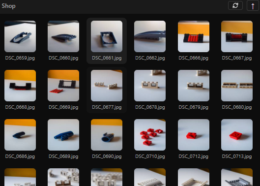
</p>

### 🎬 YouTube Player

Watch videos while you work:

- Built-in YouTube browser in a resizable panel
- Search YouTube or paste a URL directly in the search bar
- **Ad blocker** included, so no interruptions
- **In-panel fullscreen** fills only the YouTube panel, not the whole app
- Persistent session so you stay logged in

### 🎨 Themes & Languages

Make it yours:

| Dark (default) | Light | Gray | High Contrast | Televideo |
|:-:|:-:|:-:|:-:|:-:|
| 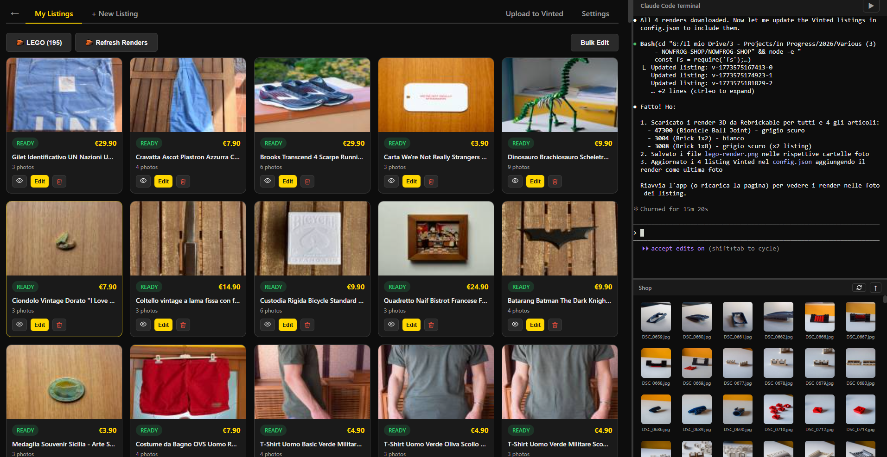 | 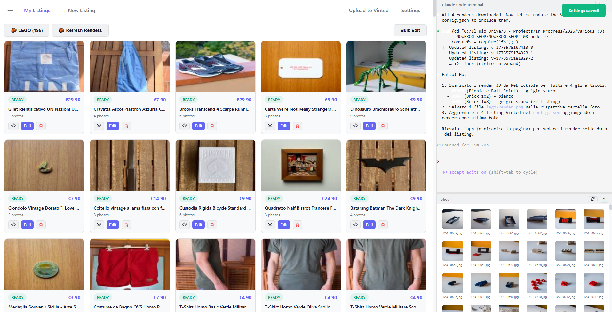 | 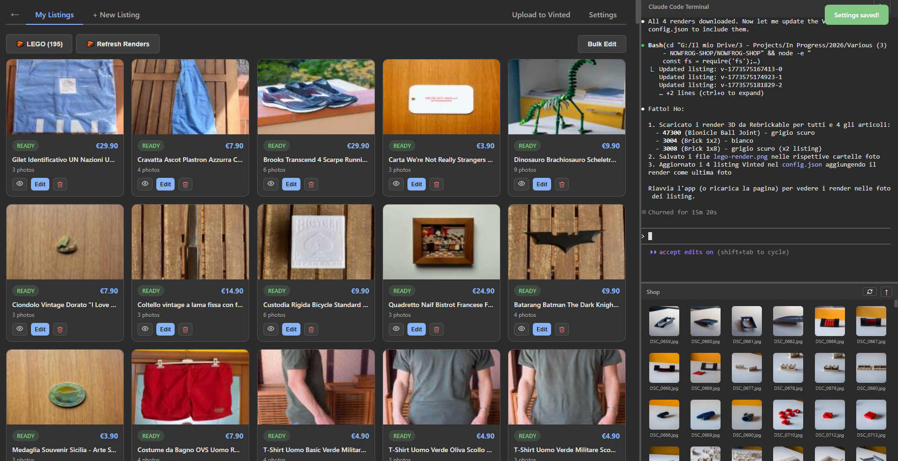 | 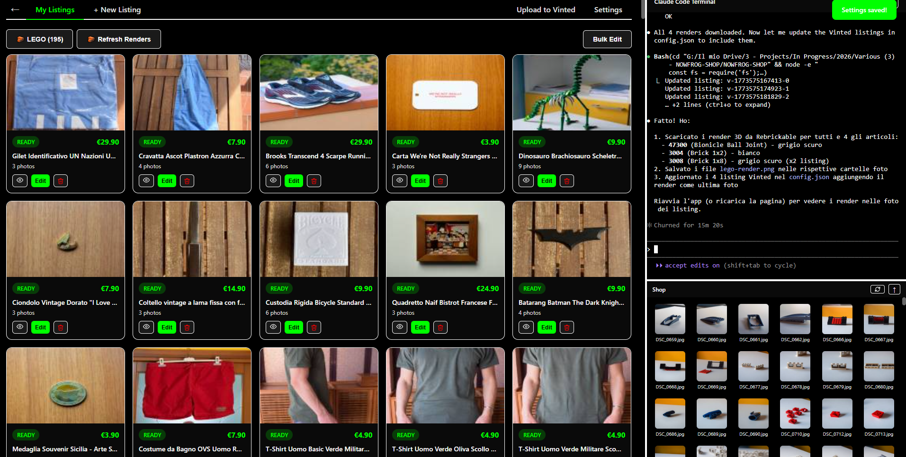 | 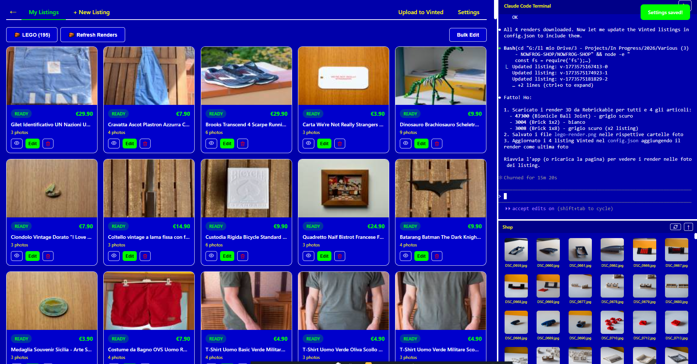 |

**11 languages supported:** English, Italian, German, Spanish, French, Japanese, Dutch, Polish, Portuguese, and Swedish. Each store can generate listings in a different language.

### 💾 Backup & Restore

Never lose your work:

- **Export** all your listings and photos as a single ZIP file
- **Import** a backup to restore everything, including listings, photos, and settings
- Works across machines: export from one PC, import on another

### 📋 Bulk Operations

Manage large inventories efficiently:

- **Bulk select** listings with checkboxes
- **Bulk edit** to change shipping, price, or other fields across multiple listings at once
- **Bulk publish** multiple eBay listings in one go
- **Bulk delete** to clean up published or unwanted listings
- Switch between **grid or list view** depending on your preference

<!-- SCREENSHOT: listings grid with bulk selection bar visible -->
<p align="center">
  
</p>

---

## Getting Started

### Download and Run (easiest)

1. Download **FROGDROP-portable.exe** from [Releases](https://github.com/nowfrog/frogdrop/releases/latest)
2. Double-click to run (no installation needed)
3. The **splash screen** checks your system:
   - ✅ **Node.js** is detected automatically
   - ⚠️ **Claude Code**: if not installed, click **"Install Claude Code"** to install it (optional, needed for AI features)
4. Click **Enter** to open the app
5. Go to **Settings** (gear icon) and set your **shop name**
6. Choose a platform and start listing!

<!-- SCREENSHOT: splash screen showing dependency checks -->
<p align="center">
  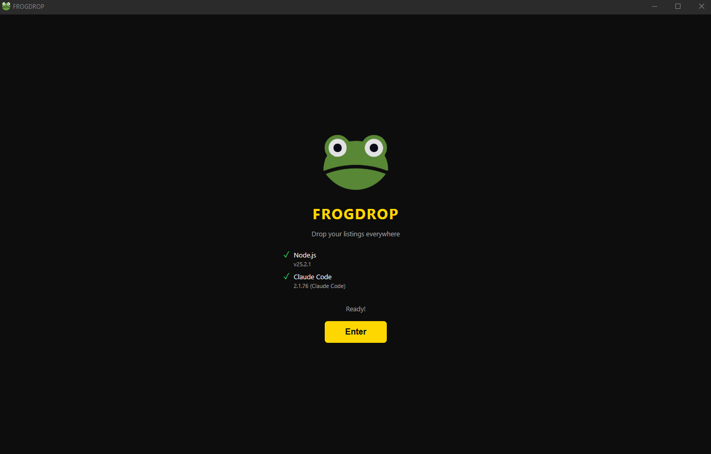
</p>

### Run from Source

```bash
# Clone the repository
git clone https://github.com/nowfrog/frogdrop.git
cd frogdrop

# Install dependencies
npm install

# Launch the app
npm start
```

### Requirements

| Requirement | For .exe | For source |
|------------|----------|------------|
| **Windows 10/11** | ✅ Required | ✅ Required |
| **Node.js 18+** | ❌ Bundled | ✅ [Download](https://nodejs.org) |
| **Claude Code** | ⚡ Optional | ⚡ Optional |

**Claude Code** is optional but recommended. It powers the AI listing generation. Without it, you can still create and manage listings manually.

```bash
# Install Claude Code globally
npm install -g @anthropic-ai/claude-code
```

### eBay API Setup

To publish listings directly to eBay, you need free API credentials:

1. Go to [developer.ebay.com](https://developer.ebay.com) and create an account
2. Create a new application (choose "Production" environment)
3. Note your **App ID (Client ID)**, **Dev ID**, and **Cert ID (Client Secret)**
4. Set up a **RuName (Redirect URI)** in your application settings
5. In FROGDROP, click on **eBay** and enter your credentials in the setup wizard
6. Click **"Save & Connect"** to authorize the app with your eBay account

> Vinted and Wallapop don't require API keys. They use the built-in browser for uploading.

---

## How It Works

```
┌─────────────┐     ┌──────────────┐     ┌─────────────────┐
│  Drop Photos │ ──→ │  Claude AI    │ ──→ │  Complete Listing│
│  into app    │     │  analyzes &   │     │  title, desc,   │
│              │     │  generates    │     │  price, specs   │
└─────────────┘     └──────────────┘     └────────┬────────┘
                                                   │
                         ┌─────────────────────────┼──────────────────────┐
                         ▼                         ▼                      ▼
                  ┌─────────────┐          ┌──────────────┐       ┌──────────────┐
                  │    eBay     │          │    Vinted     │       │   Wallapop   │
                  │  API publish│          │  drag & drop  │       │  drag & drop │
                  │  one-click  │          │  in browser   │       │  in browser  │
                  └─────────────┘          └──────────────┘       └──────────────┘
```

---

## Data Storage

| Mode | Data location |
|------|--------------|
| **Portable .exe** | `%APPDATA%\FROGDROP\` |
| **Installer** | `%APPDATA%\FROGDROP\` |
| **From source** | `./appdata/` in the project folder |

Data includes the listings database, photos, platform sessions (Vinted/Wallapop/YouTube cookies), and app settings.

---

## Tech Stack

| Technology | Purpose |
|-----------|---------|
| [Electron](https://www.electronjs.org/) | Desktop application framework |
| [Claude Code](https://claude.ai/claude-code) | AI-powered listing generation |
| [xterm.js](https://xtermjs.org/) | Integrated terminal emulator |
| [node-pty](https://github.com/microsoft/node-pty) | Terminal process management |
| [electron-store](https://github.com/sindresorhus/electron-store) | Persistent JSON storage |

---

## Contributing

Contributions are welcome! Feel free to:

- 🐛 [Report bugs](https://github.com/nowfrog/frogdrop/issues)
- 💡 [Request features](https://github.com/nowfrog/frogdrop/issues)
- 🔧 Submit pull requests

---

## Support the Project

FROGDROP is free and open-source. If it helps you sell faster and earn more, consider supporting its development:

<p align="center">
  <a href="https://paypal.me/andreamorana">
    
  </a>
</p>

---

## License

[MIT](LICENSE). Free to use, modify, and distribute.

---

<p align="center">
  Made with 🐸 by <a href="https://github.com/nowfrog">nowfrog</a>
</p>
